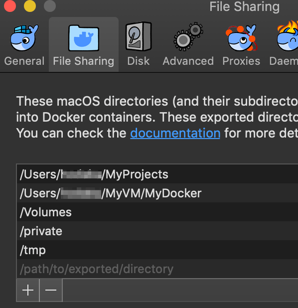

# React + Django + Postgres smaple app on Docker

This is the sample app using React, Django and Postgres on docker.

This sample app is using the following technologies:

- React
- Node.js
- Axios
- Bulma
- Python
- Django
- Django REST framework
- Postgres
- Docker
- Docker Compose

## Requirements

The app requires the following to run:

- Docker
- Docker Compose

## Getting Started

To see the app, clone the repo and execute `docker-compose up`.

```
git clone git@github.com:hodanov/react-django-postgres-sample-app.git
cd react-django-postgres-sample-app
docker-compose up
```

Then, the three Docker containers will run.

- django_db
- django_rest_api
- django_web_front

After launching their containers, access the `localhost:3000`. The SPA will be shown the below.


### django_db

The django_db is the Postgres database.

### django_rest_api

The django_rest_api is the Python/Django Web API. This returns JSON data when accessing `localhost:8000`.

### django_web_front

The django_web_front is the Node.js/React container. This fetches API data from django_rest_api using React.

## File Sharing settings

It is necessary to modify the file sharing settings, since the directory of the host will be mounted as VOLUME, depending on the directory location.



## Details about files

The app directory and files configuration the below.

```
.
├── DockerfileNode
├── DockerfilePostgres
├── DockerfilePython
├── code
│   ├── django_db
│   │   └── init-user-db.sh
│   ├── django_rest_api
│   │   ├── requirements.txt
│   │   ├── run-migrate-and-server.sh
│   │   └── test_app
│   └── django_web_front
│       ├── npm-install-and-start.sh
...     ...
└── docker-compose.yml
```

### docker-compose.yml

The configuration of the app is managed by docker-compose.yml.

### DockerfileXXXX

There are three Dockerfiles the below.

- DockerfileNode
- DockerfilePostgres
- DockerfilePython

These files are specified in docker-compose.yml and used when building each Docker images.

### code/

There are application codes in this directory.

### Entry points

There are three entry points the below.

- init-user-db.sh
- run-migrate-and-server.sh
- npm-install-and-start.sh

The app is specified some entry points in the `docker-compose.yml`. The command is executed when each container starts.

## Author

[Hoda](https://hodalog.com)
